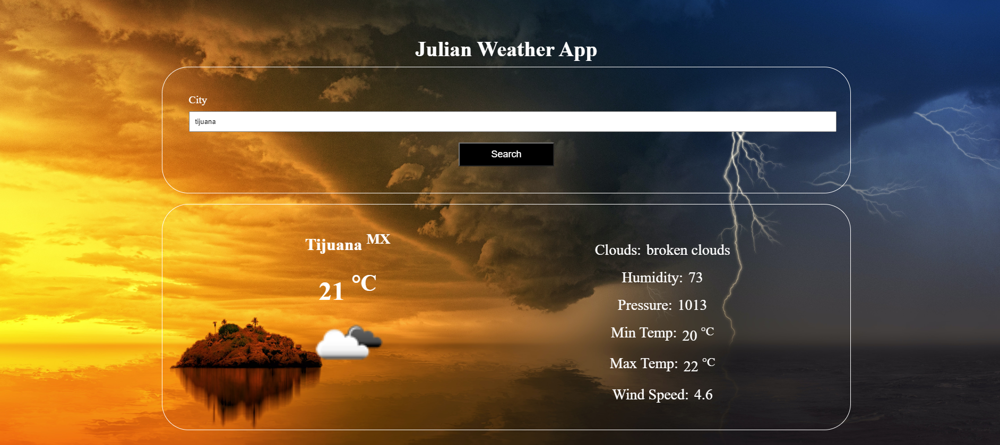

<h1 align="center">:last_quarter_moon: WEATHER APP</h1>

  

## :pencil: Description

This application consists of using the Open Weather API, in order to implement concepts such as requests and promises in Javascript and the handling of data in JSON, so that the user can search for information related to the climatic state of a city. and obtain information such as temperatures, humidity, pressure and wind speed.

This project is part of the Microverse curriculum for the Javascript course.

## :earth_americas: Live Version here:

## :heavy_check_mark: Odin Projet Link

[TODO LIST Project](https://www.theodinproject.com/courses/javascript/lessons/weather-app)

## :point_right: Functionalities

- User can search weather information about a specific city. The app will display current Temperature, Humidity, Pressure, Min Temperature, Max Temperature and Wind Speed.

## :arrow_right: Instructions to use the TODO-LIST locally

- You can clone the repo by running the next command in your command line:
  
<code>https://github.com/jucora/WEATHER-APP.git</code>

- Next, follow the route: WEATHER-APP/dist

- You'll find the index.html file, open it and you're good to go!

## :computer: Languages and Tools

- HTML
- CSS
- Javascript
- Webpack

## API

[OPEN WEATHER](https://openweathermap.org/)

## Author

:man: Julian Belmonte

- Github: [@jucora](https://github.com/jucora)
- Twitter: [@Julian Belmonte](twitter.com/JulianBelmonte)
- Linkedin: [Julian Belmonte](linkedin.com/in/julianbel)
